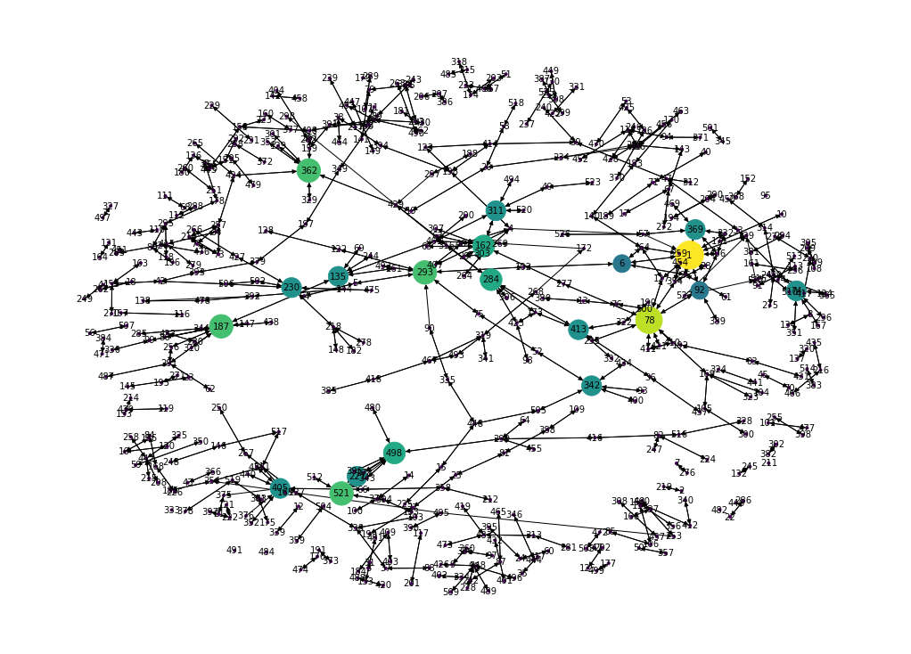

# Network Analysis for Influencer Marketing Strategy Project 

## Main Objectives 

- Describe the degree, betweenness and closeness centrality of the network  
- Identify key influencers 
   - focus on the In_degree
   - pay attention to Out_degree  
- Also, identify the people who are not connected to the network at all

## Key Steps

### Step 1: Convert the adjacency matrix to an edge list and a node list


```python
##import necessary packages 
##install pip install dataframe-image
import numpy as np
import pandas as pd 
import networkx as nx
import matplotlib.pyplot as plt
from pylab import rcParams
import dataframe_image as dfi
```


```python
##import adjacency matrix 
df = pd.read_csv('Alibaba-network.csv',index_col=0)

```


```python
##convert adjacency matrix to edgelist dataframe directional
def edgelist(df):
    a = df.values
    c = df.columns
    n = len(c)
    
    c_ar = np.array(c)
    out = np.empty((n, n, 2), dtype=c_ar.dtype)
    
    out[...,0] = c_ar[:,None]
    out[...,1] = c_ar
    
    mask = ~np.eye(n,dtype=bool)
    df_out = pd.DataFrame(out[mask], columns=[['Source','Target']])
    df_out['Weight'] = a[mask]
    return df_out
```


```python
##create an edge list with all the connections 
edge_df = pd.DataFrame()
edge_df =edgelist(df)
edge_df.columns = edge_df.columns.get_level_values(0)
edge_df_connected = edge_df.query('Weight != 0.0')
edge_df_connected=edge_df_connected[['Source','Target']]
edge_tuple = edge_df_connected.to_records(index=False,column_dtypes = {"Source":"int32", "Target":"int32"})
edges = list(edge_tuple)
```


```python
#create node list 
nodes = list(df.index)
```

### Step 2: Describe the network based on centrality measurements 


```python
##create an empty graph 
G = nx.DiGraph()
##load the edges and nodes 
G.add_edges_from(edges)
G.add_nodes_from(nodes)
```

- ### Betweenness Centrality 


```python
##sort by betweenness centrality 
betCent = nx.betweenness_centrality(G, normalized=True, endpoints=True)
betSet=set(sorted(betCent, key=betCent.get, reverse=True)[:20])
sorted(betCent.items(), key = lambda x: x[1], reverse= True)[:20]
```


    [(162, 0.018783835133464644),
     (4, 0.017096136872509344),
     (311, 0.01569252747094177),
     (78, 0.014323189106379705),
     (293, 0.01368286183601369),
     (461, 0.013546078311123297),
     (303, 0.011370468707536982),
     (29, 0.01104549510224794),
     (198, 0.010699778500876618),
     (1, 0.009753416882514082),
     (135, 0.009574245496064242),
     (277, 0.009316010225996449),
     (46, 0.00915006625733821),
     (414, 0.007572095439426844),
     (187, 0.007164450472940311),
     (39, 0.007012936414600183),
     (6, 0.0066906684174957865),
     (102, 0.006471514154539531),
     (75, 0.006441151218245179),
     (52, 0.005820665074566561)]


```python
##visualize the network -  betweenness 
rcParams['figure.figsize'] = 14, 10
pos = nx.spring_layout(G, scale=20, k=3/np.sqrt(G.order()))

high_light_nodes = betSet
node_color = [betCent[v ]* 20000 if v in high_light_nodes else 0 for v in G ]
node_size = [betCent[v ]* 30000 if v in high_light_nodes else 0 for v in G ] 
#node_size = [v * 10000 if k in high_light_nodes else 10 for k,v in zip(G,betCent.values())]

nx.draw(G, pos, node_color=node_color, 
        with_labels=True, 
        node_size=node_size,
        font_size=10,
        linewidths=1)

```


    

    


- ### Closeness Centrality 


```python
##sort by closeness centrality 
cloCent = nx.closeness_centrality(G)
cloSet=set(sorted(cloCent, key=cloCent.get, reverse=True)[:20])
sorted(cloCent.items(), key = lambda x: x[1], reverse= True)[:20]
```


    [(162, 0.0402164375548406),
     (1, 0.039457636846258706),
     (127, 0.03905569147940378),
     (92, 0.03898949539215055),
     (78, 0.03879224668021724),
     (29, 0.03827587734004796),
     (277, 0.03777307435364339),
     (364, 0.03734383487235199),
     (57, 0.036924241222100834),
     (311, 0.036924241222100834),
     (4, 0.036630258409822966),
     (303, 0.036630258409822966),
     (406, 0.03605611642847778),
     (6, 0.03555456303148195),
     (46, 0.03501339768853702),
     (293, 0.03485424588086185),
     (369, 0.034644280544230154),
     (26, 0.03433403325577436),
     (63, 0.033779445347090785),
     (65, 0.033779445347090785)]


```python
##visualize the network - closeness 
rcParams['figure.figsize'] = 14, 10
pos = nx.spring_layout(G, scale=20, k=3/np.sqrt(G.order()))

high_light_nodes = cloSet
node_color = [20000.0 * cloCent[v] if v in high_light_nodes else 0 for v in G]
node_size = [10000.0 * cloCent[v] if v in high_light_nodes else 10 for v in G] 

nx.draw(G, pos, node_color=node_color, 
        with_labels=True, 
        node_size=node_size,
        font_size=8,
        linewidths=0.5)
```


    

    


- ### In Degree


```python
##Top 20 influencers based on the number of followers. 
top10_influenceres=sorted(G.in_degree, key=lambda x: x[1], reverse=True)[:20]
rcParams['figure.figsize'] = 10, 8
plt.bar(range(len(top10_influenceres)), [val[1] for val in top10_influenceres], align='center')
plt.xticks(range(len(top10_influenceres)), [val[0] for val in top10_influenceres])
plt.xticks(rotation=70)
plt.title('Top 10 Influencers')
plt.xlabel('Influencers')
plt.ylabel('Number of Followers')
plt.savefig('Top10Influencers')
plt.show()

```


    

    


```python
##visualize the network - in degree - most interested factor
rcParams['figure.figsize'] = 14, 10
pos = nx.spring_layout(G, scale=20, k=3/np.sqrt(G.order()))

high_light_nodes = [val[0] for val in top10_influenceres]
node_color = [20000.0 * G.in_degree(v) if v in high_light_nodes else 0 for v in G]
node_size = [100.0 * G.in_degree(v) if v in high_light_nodes else 10 for v in G] 
#node_size = [v * 10000 if k in high_light_nodes else 10 for k,v in zip(G,betCent.values())]

nx.draw(G, pos, node_color=node_color, 
        with_labels=True, 
        node_size=node_size,
        font_size=10,
        linewidths=0.8)

plt.savefig('Indegree Network')
```


    

    


- ### Out Degree


```python
##Top 20 active users based on the number of people they follow
sorted(G.out_degree, key=lambda x: x[1], reverse=True)[:20]
rcParams['figure.figsize'] = 10, 8
top10_users=sorted(G.out_degree, key=lambda x: x[1], reverse=True)[:20]
plt.bar(range(len(top10_users)), [val[1] for val in top10_users], align='center')
plt.xticks(range(len(top10_users)), [val[0] for val in top10_users])
plt.xticks(rotation=70)
plt.title('Top 10 Users')
plt.xlabel('Users')
plt.ylabel('Number of people they follow')
plt.savefig('Top10Users')
plt.show()

```


    

    


```python
##visualize the network - out degree - most interested factor
rcParams['figure.figsize'] = 14, 10
pos = nx.spring_layout(G, scale=20, k=3/np.sqrt(G.order()))

high_light_nodes = [val[0] for val in top10_users]
node_color = [20000.0 * G.out_degree(v) if v in high_light_nodes else 0 for v in G]
node_size = [100.0 * G.out_degree(v) if v in high_light_nodes else 10 for v in G] 
#node_size = [v * 10000 if k in high_light_nodes else 10 for k,v in zip(G,betCent.values())]

nx.draw(G, pos, node_color=node_color, 
        with_labels=True, 
        node_size=node_size,
        font_size=10,
        linewidths=0.8)

plt.savefig('Outdegree Network')
```


    

    


### Step 3: Identify key influencers 


```python
##merge the centrality measurement into the same dataframe
in_degree_df=pd.DataFrame(G.in_degree,columns=['Person','In Degree'])
out_degree_df=pd.DataFrame(G.out_degree,columns=['Person','Out Degree'])
betCent_df=pd.DataFrame(betCent.items(), columns=['Person','Betweenness'])
cloCent_df=pd.DataFrame(cloCent.items(), columns=['Person','Closeness'])
Centrality_df=in_degree_df.merge(
    out_degree_df, 
    how='left', 
    on='Person').merge(
    betCent_df, 
    how='left', 
    on='Person').merge(
    cloCent_df,
    how='left',
    on='Person')
```

- ### Key influencers with the most followers


```python
##generate Top20_indegree table
Top20_Indegree=Centrality_df.sort_values('In Degree',ascending=False).head(20).reset_index()
Top20_Indegree
```


<div>
<style scoped>
    .dataframe tbody tr th:only-of-type {
        vertical-align: middle;
    }

    .dataframe tbody tr th {
        vertical-align: top;
    }

    .dataframe thead th {
        text-align: right;
    }
</style>
<table border="1" class="dataframe">
  <thead>
    <tr style="text-align: right;">
      <th></th>
      <th>index</th>
      <th>Person</th>
      <th>In Degree</th>
      <th>Out Degree</th>
      <th>Betweenness</th>
      <th>Closeness</th>
    </tr>
  </thead>
  <tbody>
    <tr>
      <th>0</th>
      <td>0</td>
      <td>1</td>
      <td>10</td>
      <td>9</td>
      <td>0.009753</td>
      <td>0.039458</td>
    </tr>
    <tr>
      <th>1</th>
      <td>167</td>
      <td>78</td>
      <td>9</td>
      <td>9</td>
      <td>0.014323</td>
      <td>0.038792</td>
    </tr>
    <tr>
      <th>2</th>
      <td>22</td>
      <td>293</td>
      <td>7</td>
      <td>6</td>
      <td>0.013683</td>
      <td>0.034854</td>
    </tr>
    <tr>
      <th>3</th>
      <td>53</td>
      <td>362</td>
      <td>7</td>
      <td>7</td>
      <td>0.001364</td>
      <td>0.014156</td>
    </tr>
    <tr>
      <th>4</th>
      <td>190</td>
      <td>187</td>
      <td>7</td>
      <td>7</td>
      <td>0.007164</td>
      <td>0.026811</td>
    </tr>
    <tr>
      <th>5</th>
      <td>378</td>
      <td>521</td>
      <td>7</td>
      <td>3</td>
      <td>0.000382</td>
      <td>0.013799</td>
    </tr>
    <tr>
      <th>6</th>
      <td>377</td>
      <td>498</td>
      <td>6</td>
      <td>7</td>
      <td>0.000556</td>
      <td>0.013799</td>
    </tr>
    <tr>
      <th>7</th>
      <td>74</td>
      <td>162</td>
      <td>6</td>
      <td>6</td>
      <td>0.018784</td>
      <td>0.040216</td>
    </tr>
    <tr>
      <th>8</th>
      <td>313</td>
      <td>284</td>
      <td>6</td>
      <td>6</td>
      <td>0.000458</td>
      <td>0.014905</td>
    </tr>
    <tr>
      <th>9</th>
      <td>8</td>
      <td>369</td>
      <td>5</td>
      <td>5</td>
      <td>0.001819</td>
      <td>0.034644</td>
    </tr>
    <tr>
      <th>10</th>
      <td>368</td>
      <td>230</td>
      <td>5</td>
      <td>5</td>
      <td>0.000844</td>
      <td>0.011632</td>
    </tr>
    <tr>
      <th>11</th>
      <td>148</td>
      <td>405</td>
      <td>5</td>
      <td>5</td>
      <td>0.000213</td>
      <td>0.009316</td>
    </tr>
    <tr>
      <th>12</th>
      <td>154</td>
      <td>135</td>
      <td>5</td>
      <td>5</td>
      <td>0.009574</td>
      <td>0.029992</td>
    </tr>
    <tr>
      <th>13</th>
      <td>129</td>
      <td>342</td>
      <td>5</td>
      <td>5</td>
      <td>0.005343</td>
      <td>0.024394</td>
    </tr>
    <tr>
      <th>14</th>
      <td>89</td>
      <td>413</td>
      <td>5</td>
      <td>5</td>
      <td>0.000462</td>
      <td>0.013801</td>
    </tr>
    <tr>
      <th>15</th>
      <td>373</td>
      <td>221</td>
      <td>5</td>
      <td>5</td>
      <td>0.000267</td>
      <td>0.012581</td>
    </tr>
    <tr>
      <th>16</th>
      <td>121</td>
      <td>311</td>
      <td>5</td>
      <td>5</td>
      <td>0.015693</td>
      <td>0.036924</td>
    </tr>
    <tr>
      <th>17</th>
      <td>83</td>
      <td>74</td>
      <td>5</td>
      <td>5</td>
      <td>0.003698</td>
      <td>0.019478</td>
    </tr>
    <tr>
      <th>18</th>
      <td>17</td>
      <td>198</td>
      <td>4</td>
      <td>4</td>
      <td>0.010700</td>
      <td>0.032537</td>
    </tr>
    <tr>
      <th>19</th>
      <td>413</td>
      <td>319</td>
      <td>4</td>
      <td>4</td>
      <td>0.002294</td>
      <td>0.007605</td>
    </tr>
  </tbody>
</table>
</div>


```python
##generate Top20_outdegree table
Top20_Outdegree=Centrality_df.sort_values('Out Degree',ascending=False).head(20).reset_index()
Top20_Outdegree
```


<div>
<style scoped>
    .dataframe tbody tr th:only-of-type {
        vertical-align: middle;
    }

    .dataframe tbody tr th {
        vertical-align: top;
    }

    .dataframe thead th {
        text-align: right;
    }
</style>
<table border="1" class="dataframe">
  <thead>
    <tr style="text-align: right;">
      <th></th>
      <th>index</th>
      <th>Person</th>
      <th>In Degree</th>
      <th>Out Degree</th>
      <th>Betweenness</th>
      <th>Closeness</th>
    </tr>
  </thead>
  <tbody>
    <tr>
      <th>0</th>
      <td>0</td>
      <td>1</td>
      <td>10</td>
      <td>9</td>
      <td>0.009753</td>
      <td>0.039458</td>
    </tr>
    <tr>
      <th>1</th>
      <td>167</td>
      <td>78</td>
      <td>9</td>
      <td>9</td>
      <td>0.014323</td>
      <td>0.038792</td>
    </tr>
    <tr>
      <th>2</th>
      <td>53</td>
      <td>362</td>
      <td>7</td>
      <td>7</td>
      <td>0.001364</td>
      <td>0.014156</td>
    </tr>
    <tr>
      <th>3</th>
      <td>190</td>
      <td>187</td>
      <td>7</td>
      <td>7</td>
      <td>0.007164</td>
      <td>0.026811</td>
    </tr>
    <tr>
      <th>4</th>
      <td>377</td>
      <td>498</td>
      <td>6</td>
      <td>7</td>
      <td>0.000556</td>
      <td>0.013799</td>
    </tr>
    <tr>
      <th>5</th>
      <td>22</td>
      <td>293</td>
      <td>7</td>
      <td>6</td>
      <td>0.013683</td>
      <td>0.034854</td>
    </tr>
    <tr>
      <th>6</th>
      <td>74</td>
      <td>162</td>
      <td>6</td>
      <td>6</td>
      <td>0.018784</td>
      <td>0.040216</td>
    </tr>
    <tr>
      <th>7</th>
      <td>313</td>
      <td>284</td>
      <td>6</td>
      <td>6</td>
      <td>0.000458</td>
      <td>0.014905</td>
    </tr>
    <tr>
      <th>8</th>
      <td>129</td>
      <td>342</td>
      <td>5</td>
      <td>5</td>
      <td>0.005343</td>
      <td>0.024394</td>
    </tr>
    <tr>
      <th>9</th>
      <td>368</td>
      <td>230</td>
      <td>5</td>
      <td>5</td>
      <td>0.000844</td>
      <td>0.011632</td>
    </tr>
    <tr>
      <th>10</th>
      <td>8</td>
      <td>369</td>
      <td>5</td>
      <td>5</td>
      <td>0.001819</td>
      <td>0.034644</td>
    </tr>
    <tr>
      <th>11</th>
      <td>89</td>
      <td>413</td>
      <td>5</td>
      <td>5</td>
      <td>0.000462</td>
      <td>0.013801</td>
    </tr>
    <tr>
      <th>12</th>
      <td>83</td>
      <td>74</td>
      <td>5</td>
      <td>5</td>
      <td>0.003698</td>
      <td>0.019478</td>
    </tr>
    <tr>
      <th>13</th>
      <td>376</td>
      <td>396</td>
      <td>4</td>
      <td>5</td>
      <td>0.000108</td>
      <td>0.011257</td>
    </tr>
    <tr>
      <th>14</th>
      <td>375</td>
      <td>343</td>
      <td>4</td>
      <td>5</td>
      <td>0.000108</td>
      <td>0.011257</td>
    </tr>
    <tr>
      <th>15</th>
      <td>374</td>
      <td>273</td>
      <td>4</td>
      <td>5</td>
      <td>0.000108</td>
      <td>0.011257</td>
    </tr>
    <tr>
      <th>16</th>
      <td>373</td>
      <td>221</td>
      <td>5</td>
      <td>5</td>
      <td>0.000267</td>
      <td>0.012581</td>
    </tr>
    <tr>
      <th>17</th>
      <td>14</td>
      <td>4</td>
      <td>4</td>
      <td>5</td>
      <td>0.017096</td>
      <td>0.036630</td>
    </tr>
    <tr>
      <th>18</th>
      <td>121</td>
      <td>311</td>
      <td>5</td>
      <td>5</td>
      <td>0.015693</td>
      <td>0.036924</td>
    </tr>
    <tr>
      <th>19</th>
      <td>154</td>
      <td>135</td>
      <td>5</td>
      <td>5</td>
      <td>0.009574</td>
      <td>0.029992</td>
    </tr>
  </tbody>
</table>
</div>


- ### Key active network contributors who follows the most people


```python
##save the two tables as png
dfi.export(Top20_Outdegree, 'Top20_Outdegree.png')
dfi.export(Top20_Indegree, 'Top20_Indegree.png')
```

    [0329/110839.984486:INFO:headless_shell.cc(659)] Written to file /var/folders/pb/6yhd532s4sg99gk4h46pc60m0000gn/T/tmprdu7git9/temp.png.
    [0329/110843.261368:INFO:headless_shell.cc(659)] Written to file /var/folders/pb/6yhd532s4sg99gk4h46pc60m0000gn/T/tmpvj1iovc6/temp.png.


### Step 4: Identify the isolated people 


```python
##People who are isolated from the network, no connection to anyone else
edge_df_zero=edge_df.query('Weight == 0.0')
edge_df_zero.groupby(['Source']).count().query('Weight==526')
```


<div>
<style scoped>
    .dataframe tbody tr th:only-of-type {
        vertical-align: middle;
    }

    .dataframe tbody tr th {
        vertical-align: top;
    }

    .dataframe thead th {
        text-align: right;
    }
</style>
<table border="1" class="dataframe">
  <thead>
    <tr style="text-align: right;">
      <th></th>
      <th>Target</th>
      <th>Weight</th>
    </tr>
    <tr>
      <th>Source</th>
      <th></th>
      <th></th>
    </tr>
  </thead>
  <tbody>
    <tr>
      <th>179</th>
      <td>526</td>
      <td>526</td>
    </tr>
    <tr>
      <th>211</th>
      <td>526</td>
      <td>526</td>
    </tr>
    <tr>
      <th>298</th>
      <td>526</td>
      <td>526</td>
    </tr>
    <tr>
      <th>333</th>
      <td>526</td>
      <td>526</td>
    </tr>
    <tr>
      <th>347</th>
      <td>526</td>
      <td>526</td>
    </tr>
    <tr>
      <th>446</th>
      <td>526</td>
      <td>526</td>
    </tr>
    <tr>
      <th>482</th>
      <td>526</td>
      <td>526</td>
    </tr>
    <tr>
      <th>484</th>
      <td>526</td>
      <td>526</td>
    </tr>
    <tr>
      <th>491</th>
      <td>526</td>
      <td>526</td>
    </tr>
    <tr>
      <th>95</th>
      <td>526</td>
      <td>526</td>
    </tr>
  </tbody>
</table>
</div>


