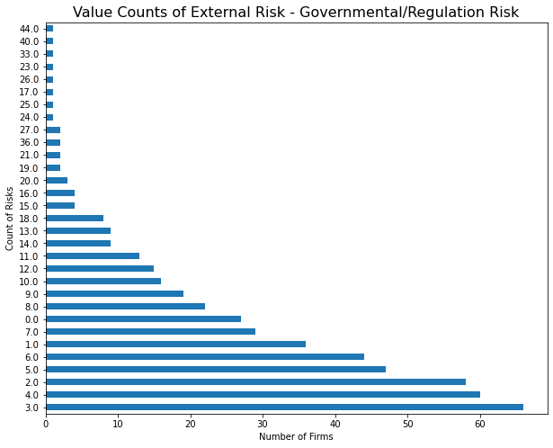
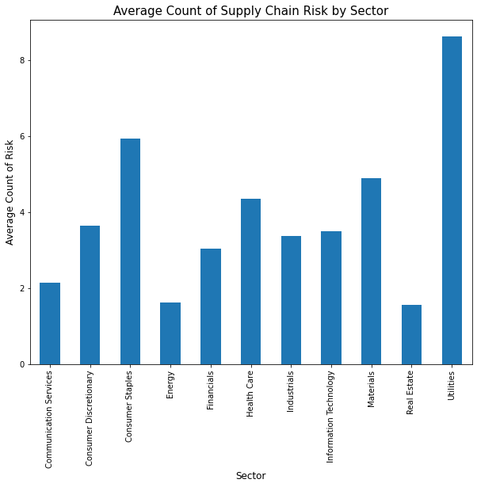

# Step 3: Analysis report


```python
import pandas as pd
import numpy as np
import matplotlib.pyplot as plt
import seaborn as sns
import datetime
from pylab import rcParams
%matplotlib inline
```

## Part 1: Explanation of risk measurements 

- ### How were the risks measured? 

Three different types of risks measured in the current analysis, namely supply chain risks, financial risks and external risks. For the external risks, they are further divided into environmental, governmental and competitional. In order to measure the risks, first, the 10-K of all the S&P500 firms were downloaded from SEC and saved in the local drive. Then, they were convert and cleaned from html to text in a variable with the function _extracto_. Subsequently,textual analysis function _NEAR_regex_ was applied to find out the times of each risk factor being discussed in a sentence or in a paragraph. The table below shows the variables input for the _NEAR_regex_ function for counting risks. keywords, distance  


Type of Risk | Keywords | Distance | Partial Matches 
:--- | :--- | :--- | :---
Supply Chain Risk | supply chain, distribution, raw materials, supplier, suppliers, risk, risks | 20 for search in a sentence | not allowed
Financial Risk |  financial, liquidity, risk, risks | 50 for search in a paragraph | not allowed
External Risk - Environmental Risk |environmental, disasters, risk, risks | 50 for search in a paragraph | not allowed
External Risk - Governmental/Regulation Risk | governmental, regulation, regulations, risk, risks | 50 for search in a paragraph| not allowed
External Risk  - Competitional Risk | competition, competitive, competitions, risk, risks | 50 for search in a paragraph | not allowed

- ### Why did you choose them and what do you hope they capture? (Economic reasoning)

The table below has summarized the reasons of why these risks were selected and the corresponding hypotheses. 

Type of Risk |Reasons for Selection| Hypotheses 
:--- | :--- | :--- 
Supply Chain Risk | It is an operational risk. Adequate supplies and efficient distribution of materials and products is essential to many businesses among the S&P500 firms. For example, a shortage of precious metals can lead to increased cost and delayed production of batteries and laptops for manufacturers. | 1. A relatively large sum of counts across all firms. 2. The average of counts from the consumer staples sector is larger than that of the financial sector. 3. Overall, increased supply chain risks negatively impact the profitability and stock return of the companies.   
Financial Risk | Being a good financial health is a protective factor for the company. Financial risks such as high debt/equity ratios, liquidity issues and inability to raise money may put the firms into difficult situations to grow.|  1. The largest sum of counts across all firms compared with other risks. 2. The average of counts of the financial sector is larger than that of the consumer staples sector. of Overall, increased financial risks may negatively impact the profitability and stock return of the companies. 
External Risk - Environmental Risk |Climate change has led to increased occurences of natural disasters which affect business continuity across sectors. For example, hurricanes may destroy the infrastructure of data centers and cause disruption of information systems for financial sectors.| 1. A relatively moderate sum of counts across all firms. 2. The average of counts from the consumer staples sector is larger than that of the financial sector. 3. Overall, increased environmental risks negatively impact the profitability and stock return of the company.
External Risk - Governmental/Regulation Risk | Businesses are normally subject to different regulations by the governments of the country in which it operates. Some regulations may restrict the business for example high tax for tobacco and alcohol sectors. While some regulations encourages some businesses, such as electrical cars and renewable energies. | 1. A relatively moderate sum of counts across all firms. 2. Increased governmental/regulation risks can have either positive or negative impacts on the profitability and stock return of the businesses. 
External Risk - Competitional Risk | There are often competing companies on the market, each of which seeks to obtain the highest position and consumer ratings on it in order to gain maximum benefits for themselves. Firms need to continuously innovate and improve their own competitive advantages, otherwise they will quickly lose customers to the competitors.| 1. A relatively moderate sum of counts across all firms. 2. Increased competitional risks can have an either positive or negative impact on the profitability and stock return of the businesses.  

- ### What are their statistical properties 

 1. Describe and value count for each risk

As expected, first, financial risks seem to be dicussed the most by S&P500 companies. As we can see from the table below, the sum, mean and max of the counts for financial risks are the highest among all the risks. There are only 13 firms that didn't mention financial risks in their 10-Ks which include the 6 firms without 10-Ks. The second mostly discussed risk is external - governmenal/regulation risk with a total count of 3131 and average of 6.20. There are only 27 firms that didn't mention this risk. The third mostly discussed risk is supply chain risks, followed by external - competitional risks and external - environmental risks. 


The table below summarizes the key statistics of the risk measurements. The cells below contains the codes and visualizations.


Type of Risk | Mean of Counts | Sums of Counts | Max Count| Number of 0 Count
:--- | :--- | :--- | :---| :---
Supply Chain Risk | 3.81 | 1925 | 22 | 93
Financial Risk |  22.91 | 11571 | 153| 13
External Risk - Environmental Risk |1.55 | 782 | 16 |204
External Risk - Governmental/Regulation Risk | 6.20 | 3131| 44 | 27
External Risk - Competitional Risk | 2.97 | 1498 | 18 | 79


```python
##load the sp500_accting_plus_textrisks datatset
sp500_risk_acct = pd.read_csv('output/sp500_accting_plus_textrisks.csv')
```


```python
##describe all risks 
sp500_risk_acct[['Supply Chain Risk','Financial Risk','Environmental Risk','Governmental/Regulation Risk','Competitional Risk']].describe()
```


<div>
<style scoped>
    .dataframe tbody tr th:only-of-type {
        vertical-align: middle;
    }

    .dataframe tbody tr th {
        vertical-align: top;
    }

    .dataframe thead th {
        text-align: right;
    }
</style>
<table border="1" class="dataframe">
  <thead>
    <tr style="text-align: right;">
      <th></th>
      <th>Supply Chain Risk</th>
      <th>Financial Risk</th>
      <th>Environmental Risk</th>
      <th>Governmental/Regulation Risk</th>
      <th>Competitional Risk</th>
    </tr>
  </thead>
  <tbody>
    <tr>
      <th>count</th>
      <td>505.000000</td>
      <td>505.000000</td>
      <td>505.000000</td>
      <td>505.000000</td>
      <td>505.000000</td>
    </tr>
    <tr>
      <th>mean</th>
      <td>3.811881</td>
      <td>22.912871</td>
      <td>1.548515</td>
      <td>6.200000</td>
      <td>2.966337</td>
    </tr>
    <tr>
      <th>std</th>
      <td>3.675079</td>
      <td>20.577581</td>
      <td>2.146916</td>
      <td>5.781196</td>
      <td>2.731514</td>
    </tr>
    <tr>
      <th>min</th>
      <td>0.000000</td>
      <td>0.000000</td>
      <td>0.000000</td>
      <td>0.000000</td>
      <td>0.000000</td>
    </tr>
    <tr>
      <th>25%</th>
      <td>1.000000</td>
      <td>13.000000</td>
      <td>0.000000</td>
      <td>3.000000</td>
      <td>1.000000</td>
    </tr>
    <tr>
      <th>50%</th>
      <td>3.000000</td>
      <td>18.000000</td>
      <td>1.000000</td>
      <td>5.000000</td>
      <td>2.000000</td>
    </tr>
    <tr>
      <th>75%</th>
      <td>6.000000</td>
      <td>25.000000</td>
      <td>2.000000</td>
      <td>8.000000</td>
      <td>4.000000</td>
    </tr>
    <tr>
      <th>max</th>
      <td>22.000000</td>
      <td>153.000000</td>
      <td>16.000000</td>
      <td>44.000000</td>
      <td>18.000000</td>
    </tr>
  </tbody>
</table>
</div>


```python
##sum of all counts for supply chain risk
sp500_risk_acct['Supply Chain Risk'].sum()            
```


    1925.0


```python
##value count for supply chain risk 
rcParams['figure.figsize'] = 10, 8
ax=sp500_risk_acct['Supply Chain Risk'].value_counts().plot.barh()
plt.title('Value Counts of Supply Chain Risk', fontsize = 15) 
plt.xlabel('Number of Firms', fontsize = 10) 
plt.ylabel('Count of Risks', fontsize = 10)
plt.show()
```


    

    


```python
##sum of all counts for financial risk 
sp500_risk_acct['Financial Risk'].sum()
```


    11571.0


```python
##value count for financial risk 
rcParams['figure.figsize'] = 18, 15
sp500_risk_acct['Financial Risk'].value_counts().plot.barh()
plt.title('Value Counts of Financial Risk', fontsize = 20) 
plt.xlabel('Number of Firms', fontsize = 15) 
plt.ylabel('Count of Risks', fontsize = 15)
plt.show()
```


    

    


```python
##sum of counts for external - environmental risk 
sp500_risk_acct['Environmental Risk'].sum()
```


    782.0


```python
##value count for external - environmental risk 
rcParams['figure.figsize'] = 10, 8
sp500_risk_acct['Environmental Risk'].value_counts().plot.barh()
plt.title('Value Counts of External Risk - Environmental Risk', fontsize = 15) 
plt.xlabel('Number of Firms', fontsize = 10) 
plt.ylabel('Count of Risks', fontsize = 10)
plt.show()
```


    

    


```python
##sum of all counts for external - governmental/regulation risk 
sp500_risk_acct['Governmental/Regulation Risk'].sum()
```


    3131.0


```python
##value count for external - governmental/regulation risk 
rcParams['figure.figsize'] = 10, 8
sp500_risk_acct['Governmental/Regulation Risk'].value_counts().plot.barh()
plt.title('Value Counts of External Risk - Governmental/Regulation Risk', fontsize = 16) 
plt.xlabel('Number of Firms', fontsize = 10) 
plt.ylabel('Count of Risks', fontsize = 10)
plt.show()
```


    

    


```python
##sum of all counts for external - competitional risk 
sp500_risk_acct['Competitional Risk'].sum()
```


    1498.0


```python
##value count for external - competitional risk 
rcParams['figure.figsize'] = 10, 8
sp500_risk_acct['Competitional Risk'].value_counts().plot.barh()
plt.title('Value Counts of External Risk - Competitional Risk', fontsize = 15) 
plt.xlabel('Number of Firms', fontsize = 10) 
plt.ylabel('Count of Risks', fontsize = 10)
plt.show()
```


    

    


2. Correlations between risk measurements and accounting measures

The correlation heatmap below shows the correlations of the risk measures with the accounting measures. A correlation between 0.3-0.7 is considered as moderately correlated, between 0.7-0.9 is highly correlated. There are some correlations observed, as described below.

   - Supply chain risks moderately correlate to the industry codes in a negative way (sic, corr=-0.3 and sic3, corr=-0.3). According to the sic code below, we can tell that the smaller the sic is, the more reliance on supply chain that sector is. For example, agriculture sector depends on supply chain much more than finance sector. 

   - External risk (Environmental risks) moderately correlate to labor ratio (l_laborratio, corr=0.41) and property, plant and equip (ppe_a, corr=0.39) of the firms. This could be explained as the more PPE or the more labor cost a firm has, the more it is subject to environmental risks.
    


Range of SIC Codes |	Division
:--- | :--- 
0100-0999	|Agriculture, Forestry and Fishing
1000-1499	|Mining
1500-1799	|Construction
1800-1999	|not used
2000-3999	|Manufacturing
4000-4999	|Transportation, Communications, Electric, Gas and Sanitary service
5000-5199	|Wholesale Trade
5200-5999	|Retail Trade
6000-6799	|Finance, Insurance and Real Estate
7000-8999	|Services
9100-9729	|Public Administration


```python
##plot a correlation heatmap of risk measurements and accounting measures
##note that environmental, governmental/regulation and competitional risks are considered as variations of external risks.
rcParams['figure.figsize'] = 30, 25
corr = sp500_risk_acct.corr()
ax=sns.heatmap(corr, cmap="Greens", annot=True)
ax.set_title('Correlation Heatmap of Risk Values and Accounting Measurements', fontsize = 30 )
plt.show()
```


    

    


## Part 2: Validation of the risk measurements 

In order to validate whether the risk measurements, the average counts of each risk measurement of all sectors were calculated and plotted as the bar charts below. Based on the scores, the corresponding industries, and the comparisons between the industries, we can interpret whether a high score or a low score makes sense. For the three variations of external risks, different keywords were used when measuring them, which generates different results. Overall, all the risk measurements are valid. Please find detailed evidence and explanations below. 

- ### Supply Chain Risk

As expected, the supply chain risks were discussed more by the firms in sectors such as consumer staples, materials and consumer discretionary, which has high average counts of the risk. It makes sense, because sourcing, production and transportation are at the center of their business. However, sectors such as finance and real estate would be less concerned about the supply chain challenges. What I found interesting is that the highest average count is found in the utility sector while the energy sector has the second lowest average count. These two sectors are vertically related, as the energy companies are generally the suppliers for the utility firms.  


```python
##compare sector, groupby['GICS Sector'].mean.count() and plot a bar chart 
rcParams['figure.figsize'] = 10, 8
sp500_risk_acct.groupby('GICS Sector')['Supply Chain Risk'].mean().plot.bar()
plt.title('Average Count of Supply Chain Risk by Sector', fontsize = 15) 
plt.xlabel('Sector', fontsize = 12) 
plt.ylabel('Average Count of Risk', fontsize = 12)
plt.show()
```


    

    


- ### Financial Risk

As expected, firms in all sectors concern about financial risks, but particularly firms in financial sectors. It is reflected by the extremely high average of counts of the risk measurement. 


```python
##compare sector, groupby['GICS Sector'].mean.count() and plot a bar chart 
rcParams['figure.figsize'] = 10, 8
sp500_risk_acct.groupby('GICS Sector')['Financial Risk'].mean().plot.bar()
plt.title('Average Count of Financial Risk by Sectors', fontsize = 15) 
plt.xlabel('Sector', fontsize = 12) 
plt.ylabel('Average Count of Risk', fontsize = 12)
plt.show()
```


    

    


- ### External - Environmental Risk

As expected, environmental risks are discussed most frequently by energy and utilities sectors, due to their high contributions to climate change and global warming. Firms in materials sector involve in production of raw materials such as chemicals or agriculture products, which are either causing damage to the environment or sensitive to environmental impacts. On the other hand, sectors such as communication services, information technology and health care are less concerned about environmental risks, which also makes sense because their businesses are less likely to be severely interrupted by environmental risks. 


```python
##compare sector, groupby['GICS Sector'].mean.count() and plot a bar chart 
rcParams['figure.figsize'] = 10, 8
sp500_risk_acct.groupby('GICS Sector')['Environmental Risk'].mean().plot.bar()
plt.title('Average Count of External Risk - Environmental Risk by Sector', fontsize = 15) 
plt.xlabel('Sector', fontsize = 12) 
plt.ylabel('Average Count of Risk', fontsize = 12)
plt.show()
```


    

    


- ### External - Governmental/Regulation Risks

Firms in financial sector and utilities sector scored the highest average counts of governmemtal/regulation risks. It is not surprised because financial institutes and utilities companies are generally guided by government policies and regulations both federal and local. The business of financial institutes can be significantly and directly impacted by the change of policies, such as the increase or decrease of interest rate. In addition, financial sector firms are facing more aggressive enforcement, higher fines and regulatory costs, and growing third-party liability. As for energy and utilities sector firms, the increasing number of policies which restrict fossil fuels but promote renewable energy forces them to closely monitor the change of regulations and make relevant business decisions quickly, in order to survive and make profit. 


```python
##compare sector, groupby['GICS Sector'].mean.count() and plot a bar chart 
rcParams['figure.figsize'] = 10, 8
sp500_risk_acct.groupby('GICS Sector')['Governmental/Regulation Risk'].mean().plot.bar()
plt.title('Average Count of External Risk - Governmental/Regulation Risk by Sector', fontsize = 15) 
plt.xlabel('Sector', fontsize = 12) 
plt.ylabel('Average Count of Risk', fontsize = 12)
plt.show()
```


    

    


- ### External - Competitional Risks

As expected, all firms across sectors concern about competitive risks. Our data shows that financial sector firms are particularly in concern about competitions with each others, followed by firms in health care sector and information technology sector. This makes sense because fierce competitions exist in these sectors and the firms have to watch out their competitors and innovate continuously to win over the customers. 


```python
##compare sector, groupby['GICS Sector'].mean.count() and plot a bar chart 
rcParams['figure.figsize'] = 10, 8
sp500_risk_acct.groupby('GICS Sector')['Competitional Risk'].mean().plot.bar()
plt.title('Average Count of External Risk - Competitional Risk by Sector', fontsize = 15) 
plt.xlabel('Sector', fontsize = 12) 
plt.ylabel('Average Count of Risk', fontsize = 12)
plt.show()
```


    

    


## Part 3: Exploration of the final sample 

The final sample includes 4 main parts: 
  - the basic information of the firms (already have)
  - the accounting information of the firms (already have)
  - the risk measurements (already have)
  - the stock return of the firm for the week of 3/9 - 3/13, 2020 (need to be calculated)

- ### Calculating the returns of the SP500 firms from the week of 3/9-3/13, 2020


```python
##load 2019-2020 stock return zip file '
stock_return = pd.read_stata("2019-2020-stock_rets cleaned.dta")
```


```python
##select 3/9-3/13 returns 
stock_return['date'].astype(int)
stock_return_2020march = stock_return[stock_return['date'].between(20200309,20200313)]
```


```python
##calculate weekly return for each firm
##Where M is Monday, F is Friday, the week's total return is  𝑟[𝑀−𝐹]=(1+𝑟𝑀)∗...∗(1+𝑟𝐹)−1
stock_return_2020march['ret'] = pd.to_numeric(stock_return_2020march['ret'], errors='coerce')
stock_return_2020march['date'] = pd.to_datetime(stock_return_2020march['date'], format='%Y%m%d', errors='ignore')
stock_return_2020march['Return'] = 1 + stock_return_2020march['ret'] 
weekly_return = (stock_return_2020march.groupby(['ticker'])['Return'].prod()-1).reset_index()
```

    /var/folders/pb/6yhd532s4sg99gk4h46pc60m0000gn/T/ipykernel_81373/2541690498.py:3: SettingWithCopyWarning: 
    A value is trying to be set on a copy of a slice from a DataFrame.
    Try using .loc[row_indexer,col_indexer] = value instead
    
    See the caveats in the documentation: https://pandas.pydata.org/pandas-docs/stable/user_guide/indexing.html#returning-a-view-versus-a-copy
      stock_return_2020march['ret'] = pd.to_numeric(stock_return_2020march['ret'], errors='coerce')
    /var/folders/pb/6yhd532s4sg99gk4h46pc60m0000gn/T/ipykernel_81373/2541690498.py:4: SettingWithCopyWarning: 
    A value is trying to be set on a copy of a slice from a DataFrame.
    Try using .loc[row_indexer,col_indexer] = value instead
    
    See the caveats in the documentation: https://pandas.pydata.org/pandas-docs/stable/user_guide/indexing.html#returning-a-view-versus-a-copy
      stock_return_2020march['date'] = pd.to_datetime(stock_return_2020march['date'], format='%Y%m%d', errors='ignore')
    /var/folders/pb/6yhd532s4sg99gk4h46pc60m0000gn/T/ipykernel_81373/2541690498.py:5: SettingWithCopyWarning: 
    A value is trying to be set on a copy of a slice from a DataFrame.
    Try using .loc[row_indexer,col_indexer] = value instead
    
    See the caveats in the documentation: https://pandas.pydata.org/pandas-docs/stable/user_guide/indexing.html#returning-a-view-versus-a-copy
      stock_return_2020march['Return'] = 1 + stock_return_2020march['ret']


```python
##merge the return to sp500 risk and acct dataframe
sp500_risk_with_return=pd.merge(sp500_risk_acct,weekly_return, how='left',left_on='Symbol', right_on='ticker',validate="one_to_one")
sp500_risk_with_return.head(5)                                     
```


<div>
<style scoped>
    .dataframe tbody tr th:only-of-type {
        vertical-align: middle;
    }

    .dataframe tbody tr th {
        vertical-align: top;
    }

    .dataframe thead th {
        text-align: right;
    }
</style>
<table border="1" class="dataframe">
  <thead>
    <tr style="text-align: right;">
      <th></th>
      <th>Symbol</th>
      <th>Security</th>
      <th>SEC filings</th>
      <th>GICS Sector</th>
      <th>GICS Sub-Industry</th>
      <th>Headquarters Location</th>
      <th>Date first added</th>
      <th>CIK</th>
      <th>Founded</th>
      <th>Path</th>
      <th>...</th>
      <th>cash_a</th>
      <th>xrd_a</th>
      <th>dltt_a</th>
      <th>invopps_FG09</th>
      <th>sales_g</th>
      <th>dv_a</th>
      <th>short_debt</th>
      <th>_merge</th>
      <th>ticker</th>
      <th>Return</th>
    </tr>
  </thead>
  <tbody>
    <tr>
      <th>0</th>
      <td>MMM</td>
      <td>3M</td>
      <td>reports</td>
      <td>Industrials</td>
      <td>Industrial Conglomerates</td>
      <td>Saint Paul, Minnesota</td>
      <td>1976-08-09</td>
      <td>66740</td>
      <td>1902</td>
      <td>10k_files/sec-edgar-filings/MMM/10-K/000155837...</td>
      <td>...</td>
      <td>0.065407</td>
      <td>0.042791</td>
      <td>0.408339</td>
      <td>2.749554</td>
      <td>NaN</td>
      <td>0.074252</td>
      <td>0.143810</td>
      <td>both</td>
      <td>MMM</td>
      <td>-0.077905</td>
    </tr>
    <tr>
      <th>1</th>
      <td>AOS</td>
      <td>A. O. Smith</td>
      <td>reports</td>
      <td>Industrials</td>
      <td>Building Products</td>
      <td>Milwaukee, Wisconsin</td>
      <td>2017-07-26</td>
      <td>91142</td>
      <td>1916</td>
      <td>10k_files/sec-edgar-filings/AOS/10-K/000119312...</td>
      <td>...</td>
      <td>0.180314</td>
      <td>0.028744</td>
      <td>0.103303</td>
      <td>NaN</td>
      <td>NaN</td>
      <td>0.048790</td>
      <td>0.056170</td>
      <td>both</td>
      <td>AOS</td>
      <td>-0.028109</td>
    </tr>
    <tr>
      <th>2</th>
      <td>ABT</td>
      <td>Abbott</td>
      <td>reports</td>
      <td>Health Care</td>
      <td>Health Care Equipment</td>
      <td>North Chicago, Illinois</td>
      <td>1964-03-31</td>
      <td>1800</td>
      <td>1888</td>
      <td>10k_files/sec-edgar-filings/ABT/10-K/000110465...</td>
      <td>...</td>
      <td>0.060984</td>
      <td>0.035942</td>
      <td>0.256544</td>
      <td>2.520681</td>
      <td>NaN</td>
      <td>0.033438</td>
      <td>0.088120</td>
      <td>both</td>
      <td>ABT</td>
      <td>-0.001101</td>
    </tr>
    <tr>
      <th>3</th>
      <td>ABBV</td>
      <td>AbbVie</td>
      <td>reports</td>
      <td>Health Care</td>
      <td>Pharmaceuticals</td>
      <td>North Chicago, Illinois</td>
      <td>2012-12-31</td>
      <td>1551152</td>
      <td>2013 (1888)</td>
      <td>10k_files/sec-edgar-filings/ABBV/10-K/00015511...</td>
      <td>...</td>
      <td>0.448005</td>
      <td>0.076216</td>
      <td>0.709488</td>
      <td>2.211589</td>
      <td>NaN</td>
      <td>0.071436</td>
      <td>0.057566</td>
      <td>both</td>
      <td>ABBV</td>
      <td>-0.038844</td>
    </tr>
    <tr>
      <th>4</th>
      <td>ABMD</td>
      <td>Abiomed</td>
      <td>reports</td>
      <td>Health Care</td>
      <td>Health Care Equipment</td>
      <td>Danvers, Massachusetts</td>
      <td>2018-05-31</td>
      <td>815094</td>
      <td>1981</td>
      <td>10k_files/sec-edgar-filings/ABMD/10-K/00015645...</td>
      <td>...</td>
      <td>0.466354</td>
      <td>0.088683</td>
      <td>0.000000</td>
      <td>12.164233</td>
      <td>NaN</td>
      <td>0.000000</td>
      <td>NaN</td>
      <td>both</td>
      <td>ABMD</td>
      <td>-0.090781</td>
    </tr>
  </tbody>
</table>
<p>5 rows × 57 columns</p>
</div>


```python
sp500_risk_with_return.columns
```


    Index(['Symbol', 'Security', 'SEC filings', 'GICS Sector', 'GICS Sub-Industry',
           'Headquarters Location', 'Date first added', 'CIK', 'Founded', 'Path',
           'Supply Chain Risk', 'Environmental Risk', 'Financial Risk',
           'Governmental/Regulation Risk', 'Competitional Risk', 'gvkey',
           'lpermno', 'datadate', 'fyear', 'tic', 'sic', 'sic3', 'td',
           'long_debt_dum', 'me', 'l_a', 'l_sale', 'div_d', 'age', 'atr',
           'smalltaxlosscarry', 'largetaxlosscarry', 'l_emp', 'l_ppent',
           'l_laborratio', 'Inv', 'Ch_Cash', 'Div', 'Ch_Debt', 'Ch_Eqty', 'Ch_WC',
           'CF', 'td_a', 'td_mv', 'mb', 'prof_a', 'ppe_a', 'cash_a', 'xrd_a',
           'dltt_a', 'invopps_FG09', 'sales_g', 'dv_a', 'short_debt', '_merge',
           'ticker', 'Return'],
          dtype='object')


- ### Describe the final sample - sp500_risk_with_return


```python
sp500_risk_with_return.describe()
```


<div>
<style scoped>
    .dataframe tbody tr th:only-of-type {
        vertical-align: middle;
    }

    .dataframe tbody tr th {
        vertical-align: top;
    }

    .dataframe thead th {
        text-align: right;
    }
</style>
<table border="1" class="dataframe">
  <thead>
    <tr style="text-align: right;">
      <th></th>
      <th>CIK</th>
      <th>Supply Chain Risk</th>
      <th>Environmental Risk</th>
      <th>Financial Risk</th>
      <th>Governmental/Regulation Risk</th>
      <th>Competitional Risk</th>
      <th>gvkey</th>
      <th>lpermno</th>
      <th>fyear</th>
      <th>sic</th>
      <th>...</th>
      <th>prof_a</th>
      <th>ppe_a</th>
      <th>cash_a</th>
      <th>xrd_a</th>
      <th>dltt_a</th>
      <th>invopps_FG09</th>
      <th>sales_g</th>
      <th>dv_a</th>
      <th>short_debt</th>
      <th>Return</th>
    </tr>
  </thead>
  <tbody>
    <tr>
      <th>count</th>
      <td>5.050000e+02</td>
      <td>505.000000</td>
      <td>505.000000</td>
      <td>505.000000</td>
      <td>505.000000</td>
      <td>505.000000</td>
      <td>355.000000</td>
      <td>355.000000</td>
      <td>355.000000</td>
      <td>355.000000</td>
      <td>...</td>
      <td>355.000000</td>
      <td>355.000000</td>
      <td>355.000000</td>
      <td>355.000000</td>
      <td>355.000000</td>
      <td>334.000000</td>
      <td>0.0</td>
      <td>355.000000</td>
      <td>349.000000</td>
      <td>490.000000</td>
    </tr>
    <tr>
      <th>mean</th>
      <td>7.887301e+05</td>
      <td>3.811881</td>
      <td>1.548515</td>
      <td>22.912871</td>
      <td>6.200000</td>
      <td>2.966337</td>
      <td>45305.952113</td>
      <td>53570.729577</td>
      <td>2018.884507</td>
      <td>4320.836620</td>
      <td>...</td>
      <td>0.151314</td>
      <td>0.247454</td>
      <td>0.126002</td>
      <td>0.031169</td>
      <td>0.296568</td>
      <td>2.698513</td>
      <td>NaN</td>
      <td>0.025464</td>
      <td>0.112481</td>
      <td>-0.121810</td>
    </tr>
    <tr>
      <th>std</th>
      <td>5.501050e+05</td>
      <td>3.675079</td>
      <td>2.146916</td>
      <td>20.577581</td>
      <td>5.781196</td>
      <td>2.731514</td>
      <td>61170.060945</td>
      <td>30143.136238</td>
      <td>0.320067</td>
      <td>1946.653427</td>
      <td>...</td>
      <td>0.074428</td>
      <td>0.218987</td>
      <td>0.138469</td>
      <td>0.050173</td>
      <td>0.181230</td>
      <td>2.107435</td>
      <td>NaN</td>
      <td>0.026991</td>
      <td>0.111168</td>
      <td>0.090491</td>
    </tr>
    <tr>
      <th>min</th>
      <td>1.800000e+03</td>
      <td>0.000000</td>
      <td>0.000000</td>
      <td>0.000000</td>
      <td>0.000000</td>
      <td>0.000000</td>
      <td>1045.000000</td>
      <td>10104.000000</td>
      <td>2018.000000</td>
      <td>100.000000</td>
      <td>...</td>
      <td>-0.323828</td>
      <td>0.009521</td>
      <td>0.002073</td>
      <td>0.000000</td>
      <td>0.000000</td>
      <td>0.405435</td>
      <td>NaN</td>
      <td>0.000000</td>
      <td>0.000000</td>
      <td>-0.610145</td>
    </tr>
    <tr>
      <th>25%</th>
      <td>9.747600e+04</td>
      <td>1.000000</td>
      <td>0.000000</td>
      <td>13.000000</td>
      <td>3.000000</td>
      <td>1.000000</td>
      <td>6286.000000</td>
      <td>19531.500000</td>
      <td>2019.000000</td>
      <td>2844.000000</td>
      <td>...</td>
      <td>0.102413</td>
      <td>0.091581</td>
      <td>0.031900</td>
      <td>0.000000</td>
      <td>0.177941</td>
      <td>1.234730</td>
      <td>NaN</td>
      <td>0.000000</td>
      <td>0.028043</td>
      <td>-0.159331</td>
    </tr>
    <tr>
      <th>50%</th>
      <td>8.820950e+05</td>
      <td>3.000000</td>
      <td>1.000000</td>
      <td>18.000000</td>
      <td>5.000000</td>
      <td>2.000000</td>
      <td>13700.000000</td>
      <td>58683.000000</td>
      <td>2019.000000</td>
      <td>3760.000000</td>
      <td>...</td>
      <td>0.138699</td>
      <td>0.162561</td>
      <td>0.072171</td>
      <td>0.009526</td>
      <td>0.285137</td>
      <td>2.155533</td>
      <td>NaN</td>
      <td>0.020454</td>
      <td>0.084992</td>
      <td>-0.106716</td>
    </tr>
    <tr>
      <th>75%</th>
      <td>1.137789e+06</td>
      <td>6.000000</td>
      <td>2.000000</td>
      <td>25.000000</td>
      <td>8.000000</td>
      <td>4.000000</td>
      <td>61582.500000</td>
      <td>82620.000000</td>
      <td>2019.000000</td>
      <td>5455.500000</td>
      <td>...</td>
      <td>0.186883</td>
      <td>0.336729</td>
      <td>0.166690</td>
      <td>0.042936</td>
      <td>0.390672</td>
      <td>3.301717</td>
      <td>NaN</td>
      <td>0.037617</td>
      <td>0.151231</td>
      <td>-0.064739</td>
    </tr>
    <tr>
      <th>max</th>
      <td>1.868275e+06</td>
      <td>22.000000</td>
      <td>16.000000</td>
      <td>153.000000</td>
      <td>44.000000</td>
      <td>18.000000</td>
      <td>316056.000000</td>
      <td>93436.000000</td>
      <td>2019.000000</td>
      <td>8742.000000</td>
      <td>...</td>
      <td>0.390384</td>
      <td>0.928562</td>
      <td>0.694612</td>
      <td>0.336795</td>
      <td>1.071959</td>
      <td>12.164233</td>
      <td>NaN</td>
      <td>0.138594</td>
      <td>0.761029</td>
      <td>0.117748</td>
    </tr>
  </tbody>
</table>
<p>8 rows × 44 columns</p>
</div>


- ### Discussion of possible issues 
    - There are a lot of missing information in the accounting measurement data set, as reflected by the count of those measurements being 355 or 349 or 334. The reasons why these information are missing are different. Therefore, it is hard to determine appropriate actions to deal with it. In addition, the amount of missing data is quite significant. Ignoring them may cause problem when analyzing the correlations between the risk measurement and the accounting measurement. In fact, as shown in the correlation heatmap above, we did not find meaningful correlation between financial risks to any of the accounting measures. It is quite surprising. Missing information could be one of the potential reasons. 

    - There are also missing information in the stock return, which is 490 rather than 505. It is likely because these companies were listed for trading after 3/13, 2020. Since there are only 15 firms, the number is not significant. Therefore, ignoring them when analysing the correlations between the risks and the stock returns should not cause a big trouble. 

## Part 4: Correlations between risk values and stock returns 

Among the risk measurements, only external risk - environmental risks appear to have a moderate reverse correlation with the stock returns, indicated by the correlation coefficient = -0.25. It means the lower the external - environmental risks are before the COVID-19 pandemic, the higher the stock return is around the onset of COVID-19. However, other risk measures including supply chain risk, financial risk, external - governmental/regulation risk and external - competitional risk were not found to have a linear correlation with stock returns, because of the close to zero correlation coefficients. This means that the level of these risks before COVID-19 pandemic is not likely to associate with the better or worse stock returns around the onset of COVID-19 in early March 2020.  


```python
##list the columns 
#sp500_risk_with_return.columns
```


```python
##extract a subset of selected variables to analyse further about correlations 
##description of the variables in ccm dataset from https://github.com/LeDataSciFi/ledatascifi-2022/blob/main/data/ccm_variable_descriptions.csv
sp500_subset = sp500_risk_with_return[['Symbol', 'Security','GICS Sector', 'GICS Sub-Industry',
                                       'Supply Chain Risk', 'Environmental Risk', 'Financial Risk',
                                       'Governmental/Regulation Risk', 'Competitional Risk', 
                                      #'l_a','ppe_a','cash_a','xrd_a',
                                       #'td_a','dltt_a',
                                       'l_sale', 'prof_a','Return']]
```


```python
##plot a correlation heatmap 
rcParams['figure.figsize'] = 15, 10
corr = sp500_subset.corr()
ax=sns.heatmap(corr, cmap="Blues", annot=True)
ax.set_title('Correlation Heatmap of Risk Values and Stock Returns', fontsize = 20 )
plt.show()
```


    

    


```python

```
