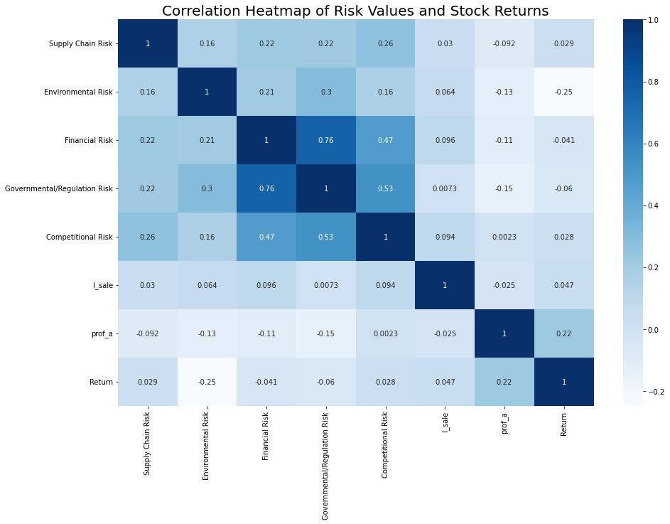
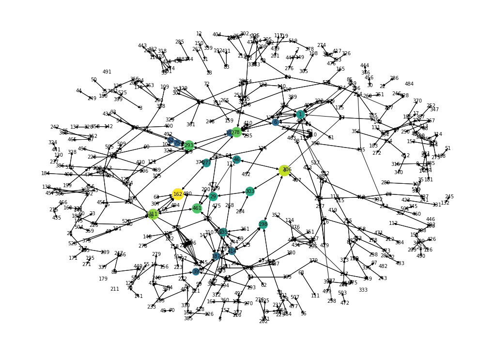

## About Me

I am an A bilingual, visionary intrapreneur, strategic planner with deep rooted public and private
sector experience. Results-oriented, creative program manager with excellent teamwork and
problem-solving skills. Experienced in helping global organizations develop inclusive
workplace cultures, which enable employees to achieve their passion and full potential. 

<!-- Upload your own photo and change the path -->

  

---

## Portfolio

<!-- You can link to other websites, PDFs in this repo, and other pages in this repo -->

_**[Natural language processing 10-Ks to identify risks](analysis_report/analysis_report.md)**_

You can show off your midterm analysis by moving the report components and output into this file. Or...

---

_**[Network Analysis for Influencer Marketing Strategy](MarketingProject/Project1.md)**_

Or: The process that created this page can be used to show off your whole midterm analysis file, as is.

---

## Career Objectives

Applying data analytics on the areas including People Operations, Organizational Development, Change Management, Talent Management, and Learning and Development, to help organizational improve efficiency, build closer communities and achieve greater impacts.  

---

Page template forked from <a href="https://github.com/evanca/quick-portfolio">evanca</a>

<!-- Remove above link if you don't want to attibute -->
