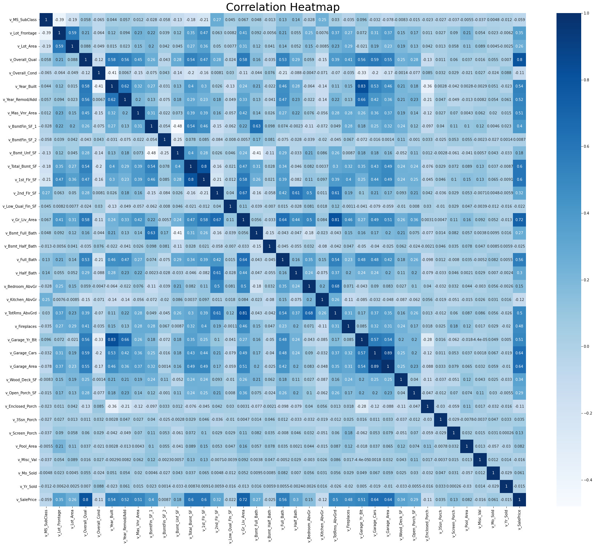

## Part 1: EDA

_Insert cells as needed below to write a short EDA/data section that summarizes the data for someone who has never opened it before._ 
- Answer essential questions about the dataset (observation units, time period, sample size, many of the questions above) 
- Note any issues you have with the data (variable X has problem Y that needs to get addressed before using it in regressions or a prediction model because Z)
- Present any visual results you think are interesting or important

### Summary of the data
- This dataset contains 1941 observations of multiple columns of house sold between 2006 to 2008. There are 78 potential independent variables which recorded the different aspects of the houses and 1 dependent variable which is the price of the house sold. 
- Some of the independent variables are continuous numbers, such as v_1st_Flr_SF, v_2nd_Flr_SF, and v_Total_Bsmt_SF. Some are categorical variables, such as v_Utilities, v_Overall_Cond, and v_Exter_Cond. 
- Some independent variable columns have lots of missing data, for example v_BsmtFin_Type_2, v_Pool_QC, v_Fireplace_Qu, v_Garage_Type, which may because some houses don't have basements, pools,garages, or fireplaces. One of the issues related to missing data is we can't take log of those variables.
- Based on the correlation heatmap, we can tell some variables are highly correlated to the sale price of the houses, 
  - v_Overall_Qual (corr=0.8)
  - v_Gr_Liv_Area (corr=0.72)
  - v_Total_Bsmt_SF (corr=0.6)
  - v_1st_Flr_SF (corr=0.6)
  - v_Garage_Cars (corr=0.64)
  - v_Garage_Area (corr=0.64) 
  - v_Full_Bath (corr=0.52)
  - v_Garage_Yr_Blt (corr=0.51)
  - v_Tot_Rms_Abv_Grd (corr=0.5)
  


```python
import pandas as pd
from statsmodels.formula.api import ols as sm_ols
import numpy as np
import seaborn as sns
from statsmodels.iolib.summary2 import summary_col # nicer tables
from pylab import rcParams
import matplotlib.pyplot as plt
%matplotlib inline
```


```python
housing = pd.read_csv('input_data2/housing_train.csv') 
```


```python
housing.describe()
```


<div>
<style scoped>
    .dataframe tbody tr th:only-of-type {
        vertical-align: middle;
    }

    .dataframe tbody tr th {
        vertical-align: top;
    }

    .dataframe thead th {
        text-align: right;
    }
</style>
<table border="1" class="dataframe">
  <thead>
    <tr style="text-align: right;">
      <th></th>
      <th>v_MS_SubClass</th>
      <th>v_Lot_Frontage</th>
      <th>v_Lot_Area</th>
      <th>v_Overall_Qual</th>
      <th>v_Overall_Cond</th>
      <th>v_Year_Built</th>
      <th>v_Year_Remod/Add</th>
      <th>v_Mas_Vnr_Area</th>
      <th>v_BsmtFin_SF_1</th>
      <th>v_BsmtFin_SF_2</th>
      <th>...</th>
      <th>v_Wood_Deck_SF</th>
      <th>v_Open_Porch_SF</th>
      <th>v_Enclosed_Porch</th>
      <th>v_3Ssn_Porch</th>
      <th>v_Screen_Porch</th>
      <th>v_Pool_Area</th>
      <th>v_Misc_Val</th>
      <th>v_Mo_Sold</th>
      <th>v_Yr_Sold</th>
      <th>v_SalePrice</th>
    </tr>
  </thead>
  <tbody>
    <tr>
      <th>count</th>
      <td>1941.000000</td>
      <td>1620.000000</td>
      <td>1941.000000</td>
      <td>1941.000000</td>
      <td>1941.000000</td>
      <td>1941.000000</td>
      <td>1941.000000</td>
      <td>1923.000000</td>
      <td>1940.000000</td>
      <td>1940.000000</td>
      <td>...</td>
      <td>1941.000000</td>
      <td>1941.000000</td>
      <td>1941.000000</td>
      <td>1941.000000</td>
      <td>1941.000000</td>
      <td>1941.000000</td>
      <td>1941.000000</td>
      <td>1941.000000</td>
      <td>1941.000000</td>
      <td>1941.000000</td>
    </tr>
    <tr>
      <th>mean</th>
      <td>58.088614</td>
      <td>69.301235</td>
      <td>10284.770222</td>
      <td>6.113344</td>
      <td>5.568264</td>
      <td>1971.321999</td>
      <td>1984.073158</td>
      <td>104.846074</td>
      <td>436.986598</td>
      <td>49.247938</td>
      <td>...</td>
      <td>92.458011</td>
      <td>49.157135</td>
      <td>22.947965</td>
      <td>2.249871</td>
      <td>16.249871</td>
      <td>3.386399</td>
      <td>52.553838</td>
      <td>6.431221</td>
      <td>2006.998454</td>
      <td>182033.238022</td>
    </tr>
    <tr>
      <th>std</th>
      <td>42.946015</td>
      <td>23.978101</td>
      <td>7832.295527</td>
      <td>1.401594</td>
      <td>1.087465</td>
      <td>30.209933</td>
      <td>20.837338</td>
      <td>184.982611</td>
      <td>457.815715</td>
      <td>169.555232</td>
      <td>...</td>
      <td>127.020523</td>
      <td>70.296277</td>
      <td>65.249307</td>
      <td>22.416832</td>
      <td>56.748086</td>
      <td>43.695267</td>
      <td>616.064459</td>
      <td>2.745199</td>
      <td>0.801736</td>
      <td>80407.100395</td>
    </tr>
    <tr>
      <th>min</th>
      <td>20.000000</td>
      <td>21.000000</td>
      <td>1470.000000</td>
      <td>1.000000</td>
      <td>1.000000</td>
      <td>1872.000000</td>
      <td>1950.000000</td>
      <td>0.000000</td>
      <td>0.000000</td>
      <td>0.000000</td>
      <td>...</td>
      <td>0.000000</td>
      <td>0.000000</td>
      <td>0.000000</td>
      <td>0.000000</td>
      <td>0.000000</td>
      <td>0.000000</td>
      <td>0.000000</td>
      <td>1.000000</td>
      <td>2006.000000</td>
      <td>13100.000000</td>
    </tr>
    <tr>
      <th>25%</th>
      <td>20.000000</td>
      <td>58.000000</td>
      <td>7420.000000</td>
      <td>5.000000</td>
      <td>5.000000</td>
      <td>1953.000000</td>
      <td>1965.000000</td>
      <td>0.000000</td>
      <td>0.000000</td>
      <td>0.000000</td>
      <td>...</td>
      <td>0.000000</td>
      <td>0.000000</td>
      <td>0.000000</td>
      <td>0.000000</td>
      <td>0.000000</td>
      <td>0.000000</td>
      <td>0.000000</td>
      <td>5.000000</td>
      <td>2006.000000</td>
      <td>130000.000000</td>
    </tr>
    <tr>
      <th>50%</th>
      <td>50.000000</td>
      <td>68.000000</td>
      <td>9450.000000</td>
      <td>6.000000</td>
      <td>5.000000</td>
      <td>1973.000000</td>
      <td>1993.000000</td>
      <td>0.000000</td>
      <td>361.500000</td>
      <td>0.000000</td>
      <td>...</td>
      <td>0.000000</td>
      <td>28.000000</td>
      <td>0.000000</td>
      <td>0.000000</td>
      <td>0.000000</td>
      <td>0.000000</td>
      <td>0.000000</td>
      <td>6.000000</td>
      <td>2007.000000</td>
      <td>161900.000000</td>
    </tr>
    <tr>
      <th>75%</th>
      <td>70.000000</td>
      <td>80.000000</td>
      <td>11631.000000</td>
      <td>7.000000</td>
      <td>6.000000</td>
      <td>2001.000000</td>
      <td>2004.000000</td>
      <td>168.000000</td>
      <td>735.250000</td>
      <td>0.000000</td>
      <td>...</td>
      <td>168.000000</td>
      <td>72.000000</td>
      <td>0.000000</td>
      <td>0.000000</td>
      <td>0.000000</td>
      <td>0.000000</td>
      <td>0.000000</td>
      <td>8.000000</td>
      <td>2008.000000</td>
      <td>215000.000000</td>
    </tr>
    <tr>
      <th>max</th>
      <td>190.000000</td>
      <td>313.000000</td>
      <td>164660.000000</td>
      <td>10.000000</td>
      <td>9.000000</td>
      <td>2008.000000</td>
      <td>2009.000000</td>
      <td>1600.000000</td>
      <td>5644.000000</td>
      <td>1474.000000</td>
      <td>...</td>
      <td>1424.000000</td>
      <td>742.000000</td>
      <td>1012.000000</td>
      <td>407.000000</td>
      <td>576.000000</td>
      <td>800.000000</td>
      <td>17000.000000</td>
      <td>12.000000</td>
      <td>2008.000000</td>
      <td>755000.000000</td>
    </tr>
  </tbody>
</table>
<p>8 rows × 37 columns</p>
</div>


```python
print("Info:",housing.info(), '\n---')
```

    <class 'pandas.core.frame.DataFrame'>
    RangeIndex: 1941 entries, 0 to 1940
    Data columns (total 81 columns):
     #   Column             Non-Null Count  Dtype  
    ---  ------             --------------  -----  
     0   parcel             1941 non-null   object 
     1   v_MS_SubClass      1941 non-null   int64  
     2   v_MS_Zoning        1941 non-null   object 
     3   v_Lot_Frontage     1620 non-null   float64
     4   v_Lot_Area         1941 non-null   int64  
     5   v_Street           1941 non-null   object 
     6   v_Alley            136 non-null    object 
     7   v_Lot_Shape        1941 non-null   object 
     8   v_Land_Contour     1941 non-null   object 
     9   v_Utilities        1941 non-null   object 
     10  v_Lot_Config       1941 non-null   object 
     11  v_Land_Slope       1941 non-null   object 
     12  v_Neighborhood     1941 non-null   object 
     13  v_Condition_1      1941 non-null   object 
     14  v_Condition_2      1941 non-null   object 
     15  v_Bldg_Type        1941 non-null   object 
     16  v_House_Style      1941 non-null   object 
     17  v_Overall_Qual     1941 non-null   int64  
     18  v_Overall_Cond     1941 non-null   int64  
     19  v_Year_Built       1941 non-null   int64  
     20  v_Year_Remod/Add   1941 non-null   int64  
     21  v_Roof_Style       1941 non-null   object 
     22  v_Roof_Matl        1941 non-null   object 
     23  v_Exterior_1st     1941 non-null   object 
     24  v_Exterior_2nd     1941 non-null   object 
     25  v_Mas_Vnr_Type     1923 non-null   object 
     26  v_Mas_Vnr_Area     1923 non-null   float64
     27  v_Exter_Qual       1941 non-null   object 
     28  v_Exter_Cond       1941 non-null   object 
     29  v_Foundation       1941 non-null   object 
     30  v_Bsmt_Qual        1891 non-null   object 
     31  v_Bsmt_Cond        1891 non-null   object 
     32  v_Bsmt_Exposure    1889 non-null   object 
     33  v_BsmtFin_Type_1   1891 non-null   object 
     34  v_BsmtFin_SF_1     1940 non-null   float64
     35  v_BsmtFin_Type_2   1891 non-null   object 
     36  v_BsmtFin_SF_2     1940 non-null   float64
     37  v_Bsmt_Unf_SF      1940 non-null   float64
     38  v_Total_Bsmt_SF    1940 non-null   float64
     39  v_Heating          1941 non-null   object 
     40  v_Heating_QC       1941 non-null   object 
     41  v_Central_Air      1941 non-null   object 
     42  v_Electrical       1940 non-null   object 
     43  v_1st_Flr_SF       1941 non-null   int64  
     44  v_2nd_Flr_SF       1941 non-null   int64  
     45  v_Low_Qual_Fin_SF  1941 non-null   int64  
     46  v_Gr_Liv_Area      1941 non-null   int64  
     47  v_Bsmt_Full_Bath   1939 non-null   float64
     48  v_Bsmt_Half_Bath   1939 non-null   float64
     49  v_Full_Bath        1941 non-null   int64  
     50  v_Half_Bath        1941 non-null   int64  
     51  v_Bedroom_AbvGr    1941 non-null   int64  
     52  v_Kitchen_AbvGr    1941 non-null   int64  
     53  v_Kitchen_Qual     1941 non-null   object 
     54  v_TotRms_AbvGrd    1941 non-null   int64  
     55  v_Functional       1941 non-null   object 
     56  v_Fireplaces       1941 non-null   int64  
     57  v_Fireplace_Qu     1001 non-null   object 
     58  v_Garage_Type      1836 non-null   object 
     59  v_Garage_Yr_Blt    1834 non-null   float64
     60  v_Garage_Finish    1834 non-null   object 
     61  v_Garage_Cars      1940 non-null   float64
     62  v_Garage_Area      1940 non-null   float64
     63  v_Garage_Qual      1834 non-null   object 
     64  v_Garage_Cond      1834 non-null   object 
     65  v_Paved_Drive      1941 non-null   object 
     66  v_Wood_Deck_SF     1941 non-null   int64  
     67  v_Open_Porch_SF    1941 non-null   int64  
     68  v_Enclosed_Porch   1941 non-null   int64  
     69  v_3Ssn_Porch       1941 non-null   int64  
     70  v_Screen_Porch     1941 non-null   int64  
     71  v_Pool_Area        1941 non-null   int64  
     72  v_Pool_QC          13 non-null     object 
     73  v_Fence            365 non-null    object 
     74  v_Misc_Feature     63 non-null     object 
     75  v_Misc_Val         1941 non-null   int64  
     76  v_Mo_Sold          1941 non-null   int64  
     77  v_Yr_Sold          1941 non-null   int64  
     78  v_Sale_Type        1941 non-null   object 
     79  v_Sale_Condition   1941 non-null   object 
     80  v_SalePrice        1941 non-null   int64  
    dtypes: float64(11), int64(26), object(44)
    memory usage: 1.2+ MB
    Info: None 
    ---


```python
rcParams['figure.figsize'] = 30, 25
corr = housing.corr()
ax=sns.heatmap(corr, cmap="Blues", annot=True)
ax.set_title('Correlation Heatmap', fontsize = 30 )
plt.show()
```


    

    


## Part 2: Running Regressions

**Run these regressions on the RAW data, even if you found data issues that you think should be addressed.**

_Insert cells as needed below to run these regressions. Note that $i$ is indexing a given house, and $t$ indexes the year of sale._ 

1. $\text{Sale Price}_{i,t} = \alpha + \beta_1 * \text{v_Lot_Area}$
1. $\text{Sale Price}_{i,t} = \alpha + \beta_1 * log(\text{v_Lot_Area})$
1. $log(\text{Sale Price}_{i,t}) = \alpha + \beta_1 * \text{v_Lot_Area}$
1. $log(\text{Sale Price}_{i,t}) = \alpha + \beta_1 * log(\text{v_Lot_Area})$
1. $log(\text{Sale Price}_{i,t}) = \alpha + \beta_1 * \text{v_Yr_Sold}$
1. $log(\text{Sale Price}_{i,t}) = \alpha + \beta_1 * (\text{v_Yr_Sold==2007})+ \beta_2 * (\text{v_Yr_Sold==2008})$
1. Choose your own adventure: Pick any five variables from the dataset that you think will generate good R2. Use them in a regression of $log(\text{Sale Price}_{i,t})$ 
    - Tip: You can transform/create these five variables however you want, even if it creates extra variables. For example: I'd count Model 6 above as only using one variable: `v_Yr_Sold`.
    - I got an R2 of 0.877 with just "5" variables. How close can you get? I won't be shocked if someone beats that!
    

**Bonus formatting trick:** Instead of reporting all regressions separately, report all seven regressions in a _single_ table using `summary_col`.


```python
housing_new = (housing
                  # create variables
                  .assign(l_saleprice = np.log(housing['v_SalePrice']),
                          l_lot_area = np.log(housing['v_Lot_Area']),
                          l_gr_liv_area = np.log(housing['v_Gr_Liv_Area']),
                          house_age= lambda x: x.v_Yr_Sold-x.v_Year_Built)
                         )
```


```python
reg1 = sm_ols('v_SalePrice ~  v_Lot_Area', data=housing_new).fit()

reg2= sm_ols('v_SalePrice ~  l_lot_area  ',  data=housing_new).fit()

reg3= sm_ols('l_saleprice ~   v_Lot_Area  ',  data=housing_new).fit()

reg4= sm_ols('l_saleprice ~  l_lot_area ',  data=housing_new).fit()

reg5= sm_ols('l_saleprice ~  v_Yr_Sold ',  data=housing_new).fit()

reg6= sm_ols('l_saleprice ~  C(v_Yr_Sold==2007) +  C(v_Yr_Sold==2008)',  data=housing_new).fit()

reg7= sm_ols('l_saleprice ~  C(v_Overall_Cond) + l_gr_liv_area + v_Total_Bsmt_SF +  v_Garage_Area +  house_age',  data=housing_new).fit()

```


```python
#format an output table
info_dict={'R-squared' : lambda x: f"{x.rsquared:.2f}",
           'Adj R-squared' : lambda x: f"{x.rsquared_adj:.2f}",
           'No. observations' : lambda x: f"{int(x.nobs):d}"}

# This summary col function combines a bunch of regressions into one nice table
print('='*108)
print('                  y = interest rate if not specified, log(interest rate else)')
print(summary_col(results=[reg1,reg2,reg3,reg4,reg5,reg6,reg7], # list the result obj here
                  float_format='%0.5f',
                  stars = True, # stars are easy way to see if anything is statistically significant
                  model_names=['1','2','3(log)','4(log)','5(log)','6(log)','7'], # these are bad names, lol. Usually, just use the y variable name
                  info_dict=info_dict,
                  regressor_order=['Intercept','v_Lot_Area','v_Yr_Sold','l_lot_area',
                                   'C(v_Yr_Sold)[2007]','C(v_Yr_Sold)[2008]',
                                   'l_gr_liv_area','v_Total_Bsmt_SF',
                                   'v_Garage_Area', 'house_age',
                                   'C(v_Overall_Cond)[10]',
                                   'C(v_Overall_Cond)[9]',
                                   'C(v_Overall_Cond)[8]',
                                   'C(v_Overall_Cond)[7]',
                                   'C(v_Overall_Cond)[6]',
                                   'C(v_Overall_Cond)[5]',
                                   'C(v_Overall_Cond)[4]',
                                   'C(v_Overall_Cond)[3]',
                                   'C(v_Overall_Cond)[2]',
                                   'C(v_Overall_Cond)[1]']
                  )
     )
```

    ============================================================================================================
                      y = interest rate if not specified, log(interest rate else)
    
    =======================================================================================================================
                                        1               2            3(log)     4(log)     5(log)      6(log)        7     
    -----------------------------------------------------------------------------------------------------------------------
    Intercept                    154789.55021*** -327915.80232*** 11.89407*** 9.40505*** 22.29321   12.02287*** 6.94999*** 
                                 (2911.59058)    (30221.34714)    (0.01463)   (0.15108)  (22.93682) (0.01614)   (0.13587)  
    v_Lot_Area                   2.64894***                       0.00001***                                               
                                 (0.22525)                        (0.00000)                                                
    v_Yr_Sold                                                                            -0.00511                          
                                                                                         (0.01143)                         
    l_lot_area                                   56028.16996***               0.28826***                                   
                                                 (3315.13919)                 (0.01657)                                    
    l_gr_liv_area                                                                                               0.59993*** 
                                                                                                                (0.01464)  
    v_Total_Bsmt_SF                                                                                             0.00018*** 
                                                                                                                (0.00001)  
    v_Garage_Area                                                                                               0.00029*** 
                                                                                                                (0.00002)  
    house_age                                                                                                   -0.00480***
                                                                                                                (0.00019)  
    C(v_Overall_Cond)[T.2]                                                                                      0.10146    
                                                                                                                (0.13372)  
    C(v_Yr_Sold == 2008)[T.True]                                                                    -0.01028               
                                                                                                    (0.02285)              
    C(v_Overall_Cond)[T.3]                                                                                      0.26083*** 
                                                                                                                (0.09323)  
    C(v_Yr_Sold == 2007)[T.True]                                                                    0.02559                
                                                                                                    (0.02225)              
    C(v_Overall_Cond)[T.9]                                                                                      0.84180*** 
                                                                                                                (0.09418)  
    C(v_Overall_Cond)[T.8]                                                                                      0.72959*** 
                                                                                                                (0.08936)  
    C(v_Overall_Cond)[T.7]                                                                                      0.66926*** 
                                                                                                                (0.08826)  
    C(v_Overall_Cond)[T.6]                                                                                      0.57703*** 
                                                                                                                (0.08822)  
    C(v_Overall_Cond)[T.5]                                                                                      0.54423*** 
                                                                                                                (0.08837)  
    C(v_Overall_Cond)[T.4]                                                                                      0.38451*** 
                                                                                                                (0.09006)  
    R-squared                    0.06658         0.12840          0.06459     0.13497    0.00010    0.00144     0.81346    
    R-squared Adj.               0.06610         0.12795          0.06411     0.13453    -0.00041   0.00041     0.81230    
    R-squared                    0.07            0.13             0.06        0.13       0.00       0.00        0.81       
    Adj R-squared                0.07            0.13             0.06        0.13       -0.00      0.00        0.81       
    No. observations             1941            1941             1941        1941       1941       1941        1939       
    =======================================================================================================================
    Standard errors in parentheses.
    * p<.1, ** p<.05, ***p<.01


## Part 3: Regression interpretation

_Insert cells as needed below to answer these questions. Note that $i$ is indexing a given house, and $t$ indexes the year of sale._ 

1. If you didn't use the `summary_col` trick, list $\beta_1$ for Models 1-6 to make it easier on your graders.
1. Interpret $\beta_1$ in Model 2. 
1. Interpret $\beta_1$ in Model 3. 
    - HINT: You might need to print out more decimal places. Show at least 2 non-zero digits. 
1. Of models 1-4, which do you think best explains the data and why?
1. Interpret $\beta_1$ In Model 5
1. Interpret $\alpha$ in Model 6
1. Interpret $\beta_1$ in Model 6
1. Why is the R2 of Model 6 higher than the R2 of Model 5?
1. What variables did you include in Model 7?
1. What is the R2 of your Model 7?
1. Speculate (not graded): Could you use the specification of Model 6 in a predictive regression? 
1. Speculate (not graded): Could you use the specification of Model 5 in a predictive regression? 


### Responses 

1. 𝛽1 
   - Model 1: 2.64894
   - Model 2: 56028.16996
   - Model 3: 0.00001
   - Model 4: 0.28826
   - Model 5: -0.00511
   - Model 6: 0.02559
   
2. Interpret  𝛽1  in Model 2
   - If the lot size increases 1%, then the sale price increase by about 560.28 dollars, when holding everything else constant. 
   
3. Interpret  𝛽1  in Model 3
   - If the lot size increases 1 square feet , then the sale price increase by about 0.001%, when holding everything else constant.
   
4. Of models 1-4, which do you think best explains the data and why? 
   - Model 4 explains the data the best, because the R-squared Adj. is the highest = 0.13453, when holding everything else constant.
   
5. Interpret  𝛽1  In Model 5
   - If the year old increases 1 year, then the sale price will decrease by about 0.511%, when holding everything else constant.
   
6. Interpret  𝛼  in Model 6
   - the average log(sale price) of 2006 is 12.02287. 
   
7. Interpret  𝛽1  in Model 6
   - sale price is about 2.559% higher for 2007 sales than 2006 sales, when holding everything else constant.
   
8. Why is the R2 of Model 6 higher than the R2 of Model 5?
   - Model 5 treated the year of sales as a continuous variable, while it is better treated as a categorical data, so R2 for Model 6 describes the dataset better. 
   
9. What variables did you include in Model 7?
   - v_Overall_Cond
   - v_gr_liv_area with a log 
   - v_Total_Bsmt_SF
   - v_Garage_Area 
   - house_age: calculated from v_Yr_Sold-v_Year_Built
   
10. What is the R2 of your Model 7?
    - 0.81230
   
